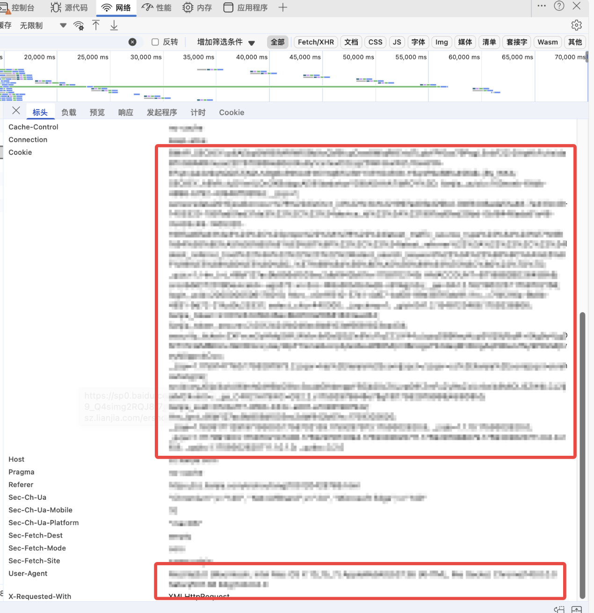
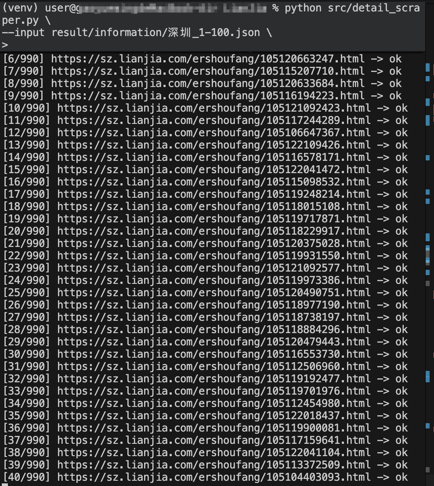

# 链家爬虫

## 功能介绍

一键爬取某城市链家在售的二手房信息,包括**标题**, **地址**, **户型**, **面积**, **朝向**, **楼层**, **建造时间**, **楼型**, **总价**, **每平米单价**和**原链接等。**

# 使用方法

## Step 1:  安装依赖

```
pip install -r requirements.txt
```

## Step 2: 登录凭证设置

链接在爬取房源列表 5 页之后的信息以及每一页的详情信息，需在登录状态下抓取, 请在运行脚本前编辑 `session_config.py`:

1. 确保已经登录链家，在浏览器中进入开发者模式，进入“网络"，刷新页面，找到 Cookie 和 User-Agent 信息。

   
2. 把浏览器开发者工具中复制到的完整 `Cookie` 串粘贴到 `DEFAULT_COOKIE_STRING`。
3. 将对应的 `User-Agent` 字符串填入 `DEFAULT_USER_AGENT`，确保与 Cookie 来源浏览器一致。
4. 如希望从文件中读取 Cookie，可把 `DEFAULT_COOKIE_FILE` 设置为 JSON/文本文件路径。
5. 运行 `session_config.py`

完成配置后, `main.py` 与 `detail_scraper.py` 会自动读取这些值, 无需在命令行重复填写。

## Step 3: 爬取数据

### 1. 获取城市基本信息

房源列表可以获取到的信息如下:

```
CSV_COLUMNS = ['title', 'location', 'configuration', 'area', 'towards', 'decorate',
               'storey', 'period', 'categorie', 'total_price', 'unit_price',
               'follow_count', 'visit_count', 'publish_time', 'tags', 'link']

CSV_HEADER_CN = ['标题', '地址', '户型', '面积', '朝向', '装修情况',
                 '层数', '建造时间', '楼型', '总价', '每平米单价',
                 '关注人数', '带看次数', '发布时间', '标签', '详情链接']
```

1. 运行 `main.py`
2. 输入城市名(中文名称).
3. 输入需爬取的页数范围 $l, r(1 \leqslant l \leqslant r \leqslant 100)$, （例如爬取 1-2 页的信息，页码输入 `1-2`)。表示爬取链家上该城市从第 $l$ 页到第 $r$ 页的所有在售二手房信息，
4. 稍事等待, 数据会自动存入 `result/information` 文件夹中的 `城市名_l-r.json` 和 `城市名_l-r.csv` 文件；爬取过程中 CSV 会以追加方式写入同一个文件.

### 2. 获取房屋详情信息

在运行 `main.py` 获取房屋列表后，可以通过爬取的原链接通过 `detail_scraper.py` 进一步获取房屋详情信息。房屋详情页可以获取到的参数如下：

```
DETAIL_COLUMNS: Tuple[str, ...] = (
    '房源标签', '核心卖点', '小区介绍', '周边配套', '交通出行', '税费解析',
    '权属抵押', '上次交易', '挂牌时间', '交易权属', '房屋用途', '房屋年限',
    '产权所属', '抵押信息', '交易属性', '户型分间'
)


```

1. 运行 detail_scraper.py

```
python 路径/detail_scraper.py \
      --input 这里填写数据来源

例如：
python src/detail_scraper.py \
      --input result/information/深圳_1-2.json
```



## 其它信息

- Modified from https://github.com/101001011/LianJia by Author: CCA
- $\rm Author: Jye10032$
- $\rm Contact\ Method:$ `736891807@qq.com`
- $\rm Date: 2025/10$
- Open Source License:GPL

## 参考网站

- https://blog.csdn.net/qq_46256922/article/details/119087591
