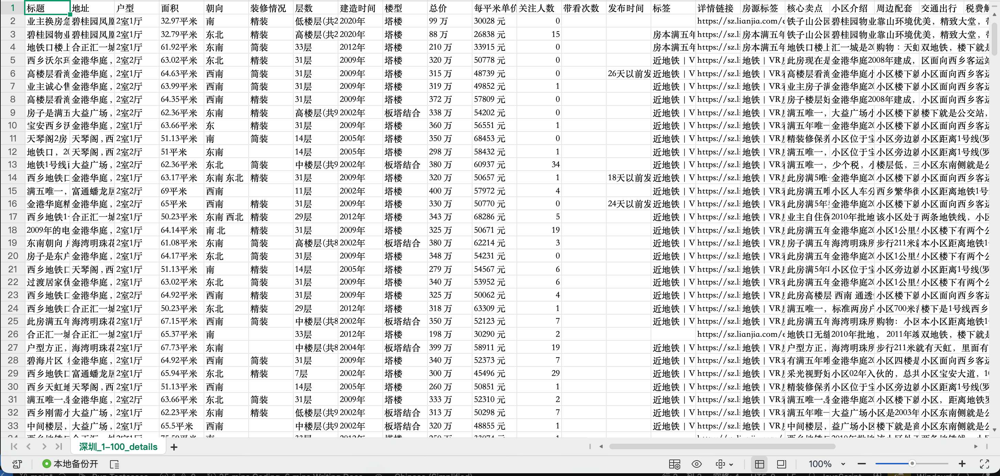
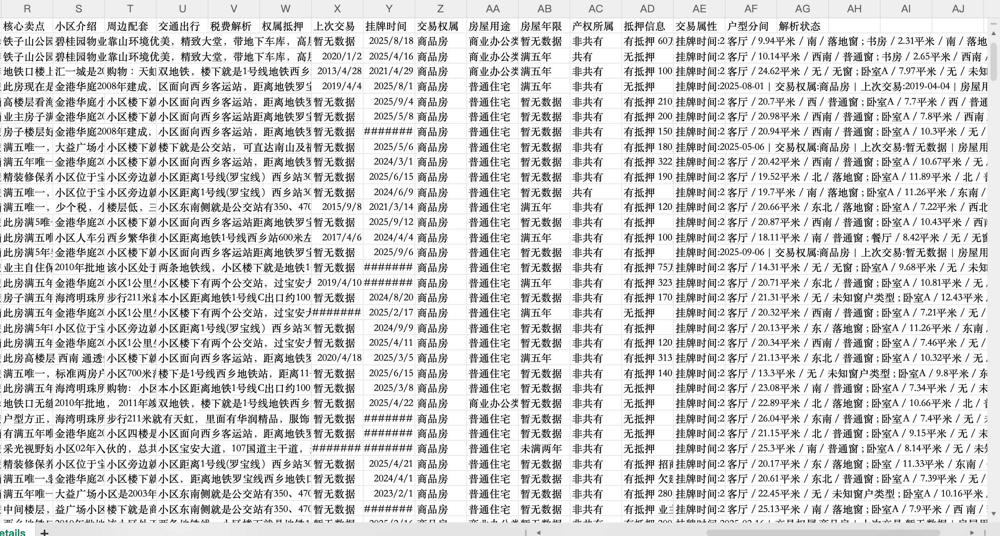
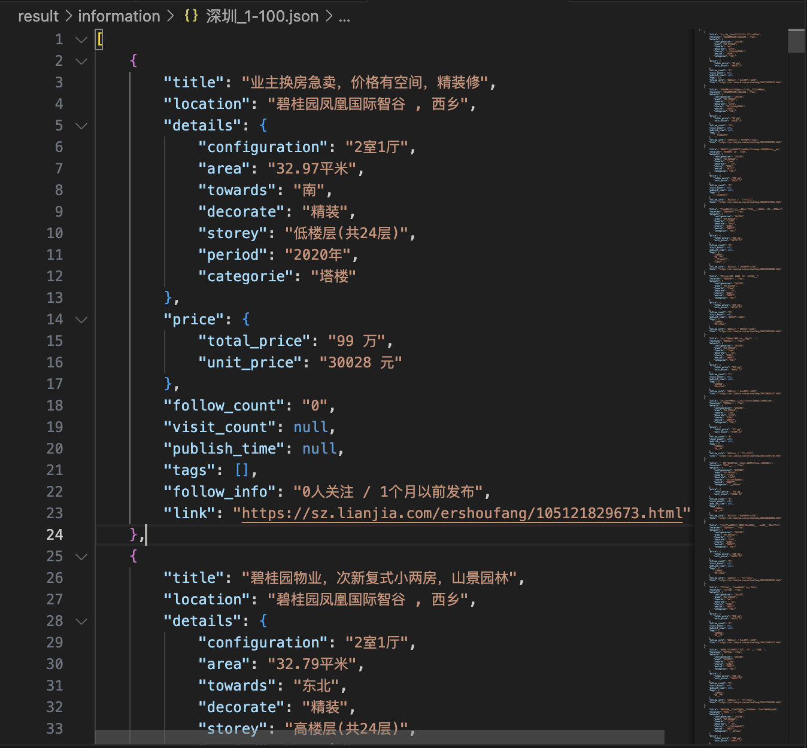
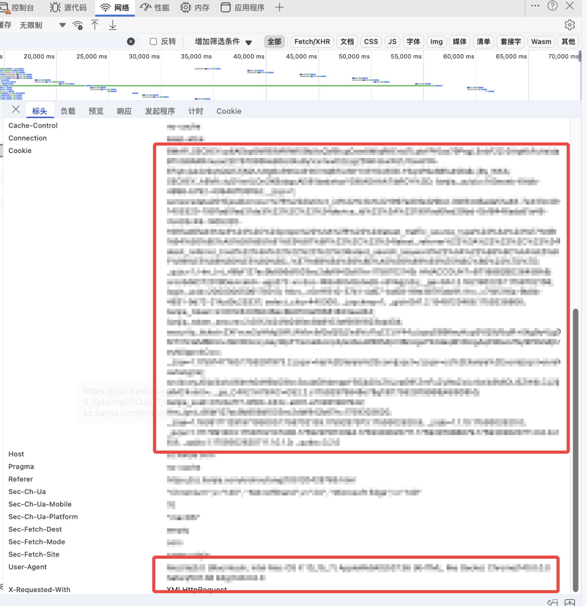
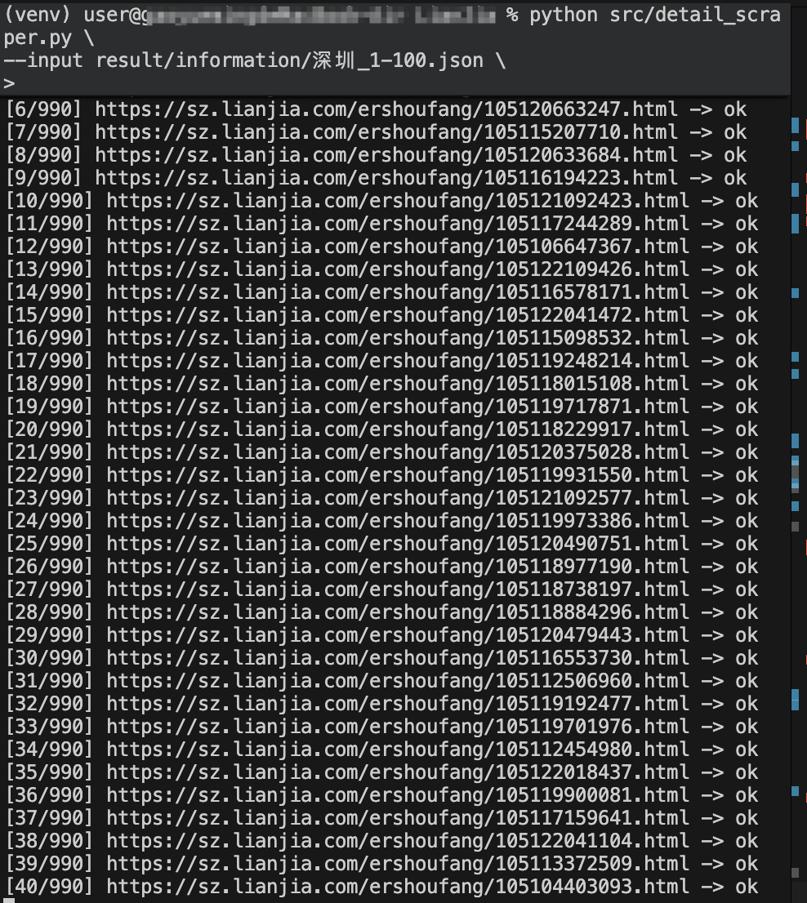

# 链家爬虫

## 功能介绍及效果展示

一键爬取某城市链家在售的二手房信息,包括**标题**, **地址**, **户型**, **面积**, **朝向**, **楼层**, **建造时间**, **楼型**, **总价**, **每平米单价**和**原链接**等，输出 CSV 格式和 JSON 格式的文件。

**新增功能：**
- **并行爬虫**: 提供多线程并行爬取版本，相比串行版本性能提升 2-3 倍
- **自动区域获取**: 输入城市名称后自动爬取该城市的区域和子区域信息
- **区域配置外置**: 区域配置保存到 JSON 文件，无需修改代码即可切换城市
- **性能监控**: 自动记录爬取指标（响应时间、状态码、字节数等）到 metrics.csv
- **工具脚本**: 提供 CSV 转 JSON、区域信息获取、性能测试等实用工具

这里是二手房的基础信息。



这里是二手房详情页面的信息。



这里是以 JSON 格式保存的二手房基础信息。



# 使用方法

## Step 1:  安装依赖

```
pip install -r requirements.txt
```

## Step 2: 登录凭证设置

链接在爬取房源列表 5 页之后的信息以及每一页的详情信息，需在登录状态下抓取, 请在运行脚本前编辑 `session_config.py`:

1. 确保已经登录链家，在浏览器中进入开发者模式，进入“网络"，刷新页面，找到 Cookie 和 User-Agent 信息。

   
2. 把浏览器开发者工具中复制到的完整 `Cookie` 串粘贴到 `DEFAULT_COOKIE_STRING`。
3. 将对应的 `User-Agent` 字符串填入 `DEFAULT_USER_AGENT`，确保与 Cookie 来源浏览器一致。
4. 如希望从文件中读取 Cookie，可把 `DEFAULT_COOKIE_FILE` 设置为 JSON/文本文件路径。
5. 运行 `session_config.py`

完成配置后, `main.py` 与 `detail_scraper.py` 会自动读取这些值, 无需在命令行重复填写。

## Step 3: 爬取数据

### 1. 获取城市基本信息

房源列表可以获取到的信息如下:

```python
CSV_COLUMNS = ['title', 'location', 'configuration', 'area', 'towards', 'decorate',
               'storey', 'period', 'categorie', 'total_price', 'unit_price',
               'follow_count', 'visit_count', 'publish_time', 'tags', 'link']

CSV_HEADER_CN = ['标题', '地址', '户型', '面积', '朝向', '装修情况',
                 '层数', '建造时间', '楼型', '总价', '每平米单价',
                 '关注人数', '带看次数', '发布时间', '标签', '详情链接']
```

#### 方式 A: 串行爬取（适合小规模数据）

1. 运行 `main.py`
2. 输入城市名(中文名称).
3. 输入需爬取的页数范围 $l, r(1 \leqslant l \leqslant r \leqslant 100)$, （例如爬取 1-2 页的信息，页码输入 `1-2`)。表示爬取链家上该城市从第 $l$ 页到第 $r$ 页的所有在售二手房信息。
4. 稍事等待, 数据会自动存入 `result/information` 文件夹中的 `城市名_l-r.json` 和 `城市名_l-r.csv` 文件；为防止数据丢失，每抓取一页就将信息写入 CSV，爬取过程中 CSV 会以追加方式写入同一个文件。

#### 方式 B: 并行爬取（推荐，性能提升 2-3 倍）

1. 运行 `src/parallel_main.py`
   ```bash
   python src/parallel_main.py
   ```

2. 输入城市名称（中文），程序会自动爬取该城市的区域和子区域信息
   ```
   请输入城市名称: 深圳
   正在获取 深圳(sz) 的区域信息...
     获取 futianqu 的子区域...
     获取 nanshanqu 的子区域...
     ...
   已保存到 data/region_subregions.json
   共 10 个区域
   ```

3. 输入需爬取的页数范围（例如 `1-8`）

4. 数据将自动保存到 `result/{城市名}/` 文件夹，包括：
   - `{区域}_{子区域}.csv` - 房源列表数据
   - `{区域}_{子区域}.json` - JSON 格式数据
   - `metrics.csv` - 爬取性能指标（响应时间、状态码、字节数等）

**区域配置文件** (`data/region_subregions.json`)：
```json
{
  "domain_root": "https://sz.lianjia.com/ershoufang/",
  "regions": {
    "futianqu": ["bagualing", "baihua", "chegongmiao", ...],
    "nanshanqu": ["baishizhou", "daxuecheng", "hongshuwan", ...]
  }
}
```

**并行爬虫特性：**
- 4 个工作线程并发爬取
- 令牌桶限速器（全局 0.6 req/s，子区域 0.2 req/s）
- 专用写入线程，异步磁盘 I/O
- 自动重试机制（指数退避 + 抖动）
- 实时性能监控

### 2. 获取房屋详情信息

在运行 `main.py` 或 `parallel_main.py` 获取房屋列表后，可以通过爬取的原链接通过 `detail_scraper.py` 进一步获取房屋详情信息。房屋详情页可以获取到的参数如下：

```python
DETAIL_COLUMNS: Tuple[str, ...] = (
    '房源标签', '核心卖点', '小区介绍', '周边配套', '交通出行', '税费解析',
    '权属抵押', '上次交易', '挂牌时间', '交易权属', '房屋用途', '房屋年限',
    '产权所属', '抵押信息', '交易属性', '户型分间'
)
```

1. 运行 detail_scraper.py

```bash
python src/detail_scraper.py --input <数据来源路径>

# 例如：
python src/detail_scraper.py --input result/information/深圳_1-2.json
# 或并行爬虫产生的数据：
python src/detail_scraper.py --input result/guangzhou/boluo_boluolongxi.json
```



## 工具脚本

### 1. CSV 转 JSON (csv_to_json.py)

将 CSV 格式的房源数据转换为 JSON 格式，用于恢复因程序中断而未生成的 JSON 文件。

```bash
python src/csv_to_json.py
```

**功能：**
- 自动查找指定目录下的所有 CSV 文件（排除 metrics.csv）
- 批量转换为 JSON 格式
- 保持与原始爬虫输出相同的数据结构

### 2. 获取区域信息 (get_regions.py)

自动爬取指定城市的区域和子区域信息，保存到配置文件。

```bash
python src/get_regions.py
```

**功能：**
- 输入城市中文名称，自动获取城市代码
- 爬取该城市所有区域和子区域
- 保存到 `data/region_subregions.json`

**注意：** `parallel_main.py` 已集成此功能，通常无需单独运行。

### 3. 层级结构获取 (get_region_info_hierarchical.py)

获取城市的区域-子区域层级结构，适用于深圳、惠州等有明确区域划分的城市。

```bash
python src/get_region_info_hierarchical.py
```

### 4. 简单列表获取 (get_region_info_simple.py)

获取城市的所有区域（平铺结构），适用于东莞等以镇为主的行政区划。

```bash
python src/get_region_info_simple.py
```

### 5. 性能测试 (performance_test.py)

对比串行爬虫和并行爬虫的实际性能。

```bash
python src/performance_test.py
```

**功能：**
1. **分析现有数据**：解析 metrics.csv 文件，展示爬取统计信息
   - 总耗时、请求数、成功率
   - 实际请求频率 (req/s)
   - 平均响应时间
   - 各区域统计信息

2. **运行基准测试**：实际运行串行和并行版本进行对比（需谨慎使用）

3. **理论计算对比**：基于配置参数计算理论性能

**示例输出：**
```
============================================================
总耗时: 1234.56 秒 (20.58 分钟)
总请求数: 240
成功请求数: 238 (99.2%)
实际请求频率: 0.594 req/s
平均响应时间: 1.85 秒

每个区域统计:
                 total  avg_duration  success
region
boluo              240          1.85      238
============================================================
```

## 示例数据

项目包含示例爬取结果，位于 `result/example/` 目录：

- `information2/` - 深圳罗湖区部分子区域数据（串行爬虫示例）
- `information3/` - 深圳多个区域完整数据（并行爬虫示例）
  - 包含宝安区、福田区、罗湖区、南山区、龙岗区等
  - 每个区域-子区域独立的 CSV 和 JSON 文件
  - 总计数百个房源数据文件

**数据格式示例** (`baoanqu_baoanzhongxin.json`)：
```json
[
  {
    "title": "宝安壹方城商圈海纳公馆3房精装修",
    "location": "新锦安海纳公馆 , 宝安中心",
    "configuration": "3室2厅",
    "area": "89平米",
    "towards": "南",
    "decorate": "精装",
    "storey": "49层",
    "period": "2021年",
    "categorie": "板塔结合",
    "total_price": "1018 万",
    "unit_price": "114383 元",
    "follow_count": "0",
    "visit_count": null,
    "publish_time": "28天以前发布",
    "tags": ["近地铁", "VR看装修"],
    "link": "https://sz.lianjia.com/ershoufang/105122069778.html"
  }
]
```

## 其它信息

### 项目结构

```
Lianjia-crawler/
├── src/                          # 源代码目录
│   ├── main.py                   # 串行爬虫主程序
│   ├── parallel_main.py          # 并行爬虫主程序（推荐）
│   ├── get_regions.py            # 自动获取城市区域信息
│   ├── detail_scraper.py         # 房屋详情爬取
│   ├── session_config.py         # 登录凭证配置
│   ├── csv_to_json.py           # CSV转JSON工具
│   ├── get_region_info_hierarchical.py  # 获取层级区域信息
│   ├── get_region_info_simple.py        # 获取简单区域列表
│   └── performance_test.py       # 性能测试工具
├── data/                         # 数据配置
│   ├── CITY_CODE.json           # 城市代码映射
│   ├── USER_AGENTS.json         # User-Agent 列表
│   └── region_subregions.json   # 区域配置（自动生成）
├── result/                       # 爬取结果
│   ├── {城市名}/                # 并行爬虫输出目录
│   ├── information/             # 串行爬虫输出
│   └── example/                 # 示例数据
└── requirements.txt             # 依赖列表
```

### 技术特性对比

| 特性 | main.py (串行) | parallel_main.py (并行) |
|------|---------------|----------------------|
| 爬取方式 | 单线程顺序执行 | 多线程并发执行 |
| 性能 | 基准 | 2-3倍提升 |
| 限速策略 | 固定延迟 | 令牌桶限速器 |
| I/O模型 | 同步阻塞 | 并发I/O + 异步写入 |
| 重试机制 | 基础重试 | 指数退避 + 抖动 |
| 性能监控 | ✗ | ✓ (metrics.csv) |
| 适用场景 | 小规模爬取 | 大规模批量爬取 |
| 区域配置 | 城市级别 | 自动获取区域-子区域 |

### 性能说明

**并行爬虫性能提升来源：**
1. **并发I/O** - 网络等待期间其他线程继续工作
2. **智能限速器** - 令牌桶算法平滑控制请求频率
3. **异步磁盘I/O** - 专用写入线程解耦网络和磁盘操作
4. **线程池复用** - 避免频繁创建销毁线程开销

**实测数据** (240个请求，惠州博罗区 1-8页)：
- 并行版本：约 20 分钟
- 理论串行版本：约 45-60 分钟
- 加速比：2-3倍

### 注意事项

1. **Cookie 有效期**：登录凭证会过期，出现大量失败时需更新 `session_config.py`
2. **限速保护**：并行爬虫已内置限速器，避免过快请求导致封禁
3. **数据完整性**：并行爬虫有周期性 flush 机制，即使中断也能保存大部分数据
4. **区域配置**：使用 `get_region_info_*.py` 工具获取正确的区域代码
5. **性能调优**：可根据网络环境调整 `parallel_main.py` 中的限速参数

- Modified from https://github.com/101001011/LianJia by Author: CCA
- $\rm Author: Jye10032$
- $\rm Contact\ Method:$ `736891807@qq.com`
- $\rm Date: 2025/10$
- Open Source License:GPL

## 参考网站

- https://blog.csdn.net/qq_46256922/article/details/119087591
